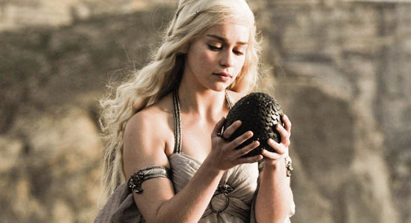

# 🖼️ Motivation Meme Project

👋 Hi there! Welcome to **Day 44** of my **Python Bootcamp** journey!  
Although this project uses **HTML and CSS**, it’s part of my broader learning path — building my web development foundation before diving deeper into Python-powered web apps. 🚀

---

## 💡 Project Overview

This mini project is called **"Motivation Meme"**.  
It’s a simple and elegant web page displaying a **motivational meme** — combining an image, a bold heading, and a fun caption.

🧠 **Purpose:**  
To practice HTML structure, CSS styling, and image layout design while learning about typography and alignment.

---

## 🧱 Files Included

1. **`index.html`** 🧾

   - Defines the webpage structure.
   - Displays an image with a caption and heading.
   - Connects to an external CSS file for styling.

2. **`style.css`** 🎨
   - Handles the visual design and layout.
   - Adds color, alignment, fonts, and spacing.

---

## 🖋️ HTML Explained

```html
<!DOCTYPE html>
<html lang="en">
  <head>
    <meta charset="UTF-8" />
    <meta name="viewport" content="width=device-width, initial-scale=1.0" />
    <link rel="stylesheet" href="style.css" />
    <link rel="preconnect" href="https://fonts.googleapis.com" />
    <link rel="preconnect" href="https://fonts.gstatic.com" crossorigin />
    <link
      href="https://fonts.googleapis.com/css2?family=Libre+Baskerville:ital,wght@0,400;0,700;1,400&display=swap"
      rel="stylesheet"
    />
    <title>Motivation Meme</title>
  </head>
  <body>
    <div>
      
      <h1>That special moment</h1>
      <p>When you find the perfect avocado at the supermarket</p>
    </div>
  </body>
</html>
```

🧩 **Breakdown:**

- `<link>` tags import Google Fonts and CSS.
- `<div>` groups the image, heading, and paragraph together.
- The meme image (`daenerys.jpeg`) is displayed with a caption.
- Text uses the **Libre Baskerville** font for a classic look.

---

## 🎨 CSS Styling

```css
h1 {
  font-family: "Libre Baskerville", serif;
  color: white;
  text-transform: uppercase;
}

body {
  background-color: black;
  text-align: center;
}

p {
  color: white;
}

img {
  width: 100%;
  border: 5px solid white;
}

div {
  width: 50%;
  margin-left: 25%;
  margin-top: 30%;
}
```

🧵 **Explanation:**

- The **black background** contrasts beautifully with the **white text**.
- The image fills the container width and gets a **white border** for emphasis.
- The text is **centered** for a meme-like layout.
- The `div` container ensures the meme is centered horizontally and vertically.

---

## 🖼️ Output Preview

✨ The page displays:

- A black background
- A centered image with a white border
- A heading: _"That special moment"_
- A caption: _"When you find the perfect avocado at the supermarket"_

---

## 🧠 What I Learned

✅ How to structure a webpage with **HTML**  
✅ How to style with **CSS** (colors, text, and alignment)  
✅ How to use **Google Fonts**  
✅ How to properly link CSS and assets  
✅ The importance of layout and design balance
